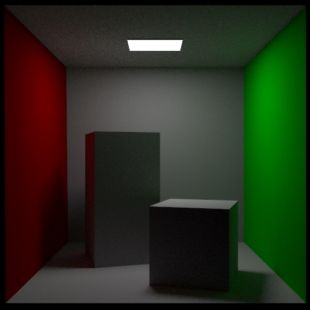

gopt
===

[](https://travis-ci.org/tatsy/gopt)
[](https://coveralls.io/github/tatsy/gopt)

> Physically based path tracer implemented with Go.

## Usage

```sh
export GOPATH=`pwd`
go build ./src/main.go
./main -i [Scene JSON file]
```

## Result

#### Gopher


#### Cornell box



The scene courtesy of Mitsuba renderer (W. Jakob 2010).

## Copyright

MIT License 2017 (c) Tatsuya Yatagawa (tatsy)
